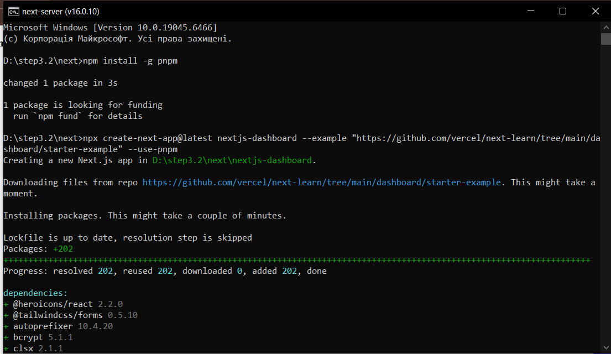
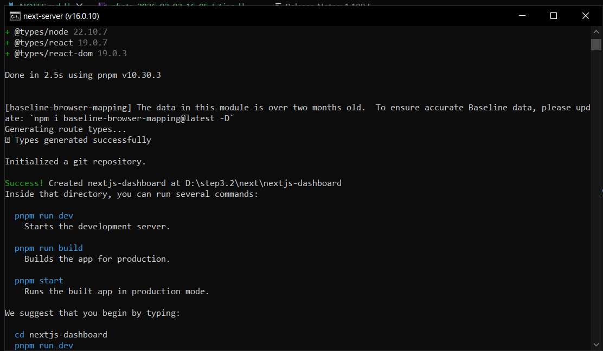
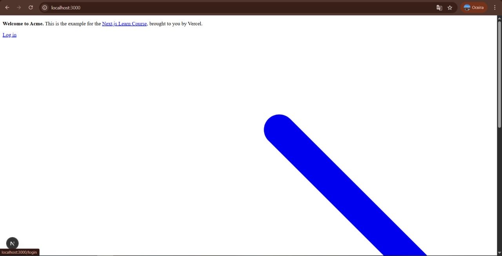

# Next.js Dashboard Tutorial Notes

## Розділ 1. Початок роботи

### 1. Встановлення pnpm
Встановила pnpm глобально через npm.

Команда:
npm install -g pnpm

У консолі відобразилось повідомлення:
- changed 1 package in 3s  
- 1 package is looking for funding  

Помилок не було, встановлення пройшло успішно.

### 2. Створення проєкту
Створила проєкт через create-next-app з прикладом dashboard.

Команда:
npx create-next-app@latest nextjs-dashboard --example "https://github.com/vercel/next-learn/tree/main/dashboard/starter-example" --use-pnpm

Під час створення:
- було встановлено 202 пакети
- автоматично ініціалізовано Git репозиторій
- згенеровано route types
- використовується Next.js 16.0.10

Процес завершився повідомленням:
`Success! Created nextjs-dashboard`

### 3. Запуск dev-сервера
Перейшла в папку проєкту:
cd nextjs-dashboard

Виконала:
pnpm dev

Сервер запустився успішно:
- Next.js 16.0.10 (Turbopack)
- Local: http://localhost:3000
- Ready in 874ms

У консолі відображаються HTTP-запити:
- GET / 200
- GET /login 404

Це означає, що головна сторінка працює, а маршрут `/login` поки що не знайдений.

### 4. Перевірка роботи в браузері
Відкрила http://localhost:3000 у браузері.

Головна сторінка відобразилась коректно.

## Розділ 2. CSS-стилізація

