# Next.js Dashboard Tutorial Notes

## Розділ 1. Початок роботи

### 1. Встановлення pnpm
Встановила pnpm глобально через npm.

Команда:
npm install -g pnpm

У консолі відобразилось повідомлення:
- changed 1 package in 3s  
- 1 package is looking for funding  

Помилок не було, встановлення пройшло успішно.


### 2. Створення проєкту
Створила проєкт через create-next-app з прикладом dashboard.

Команда:
npx create-next-app@latest nextjs-dashboard --example "https://github.com/vercel/next-learn/tree/main/dashboard/starter-example" --use-pnpm


Під час створення:
- було встановлено 202 пакети
- автоматично ініціалізовано Git репозиторій
- згенеровано route types
- використовується Next.js 16.0.10

Процес завершився повідомленням:
`Success! Created nextjs-dashboard`


### 3. Запуск dev-сервера
Перейшла в папку проєкту:
cd nextjs-dashboard

Виконала:
pnpm dev

Сервер запустився успішно:
- Next.js 16.0.10 (Turbopack)
- Local: http://localhost:3000
- Ready in 874ms

У консолі відображаються HTTP-запити:
- GET / 200
- GET /login 404

Це означає, що головна сторінка працює, а маршрут `/login` поки що не знайдений.

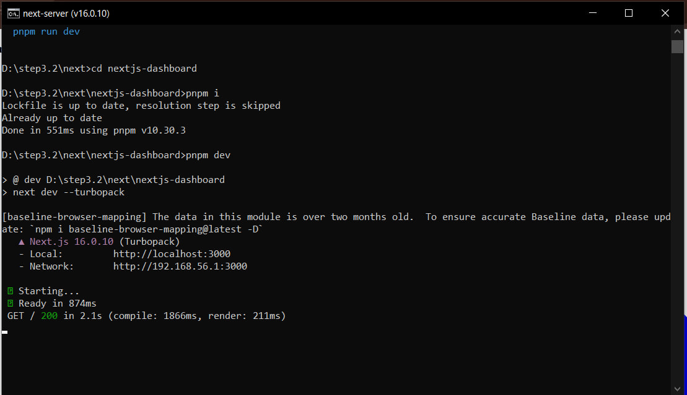

### 4. Перевірка роботи в браузері
Відкрила http://localhost:3000 у браузері.

Головна сторінка відобразилась коректно.


## Розділ 2. CSS-стилізація

### 1. Додавання глобальних стилів

Перейшла до файлу:

`/app/layout.tsx`

І додала імпорт глобальних стилів.
Тепер головна сторінка відображається зі стилями.

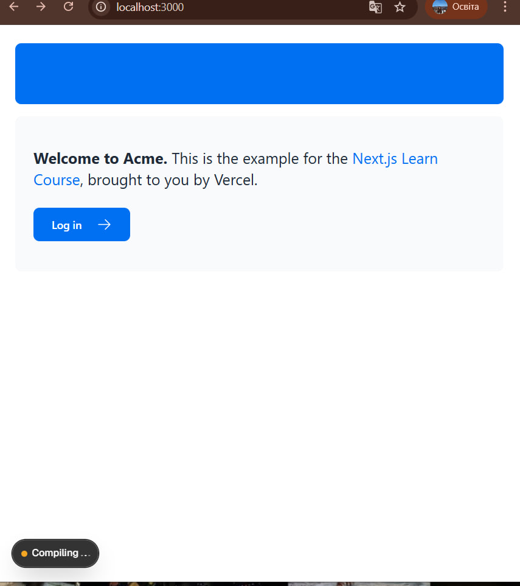

### 2. Використання Tailwind у page.tsx

У файлі `/app/page.tsx` вже використовуються класи Tailwind:

- flex
- min-h-screen
- p-6
- bg-blue-500
- rounded-lg

Це означає, що стилізація відбувається без окремих CSS-файлів для компонентів.

### 3. Додавання власного Tailwind-елемента

Я додала перед елементом `<p>` у `/app/page.tsx` наступний код:

```jsx
<div
  className="relative w-0 h-0 border-l-[15px] border-r-[15px] border-b-[26px] border-l-transparent border-r-transparent border-b-black"
/>
```

Після збереження змін на сторінці з’явився чорний трикутник.
Це приклад створення фігури лише за допомогою Tailwind-класів.

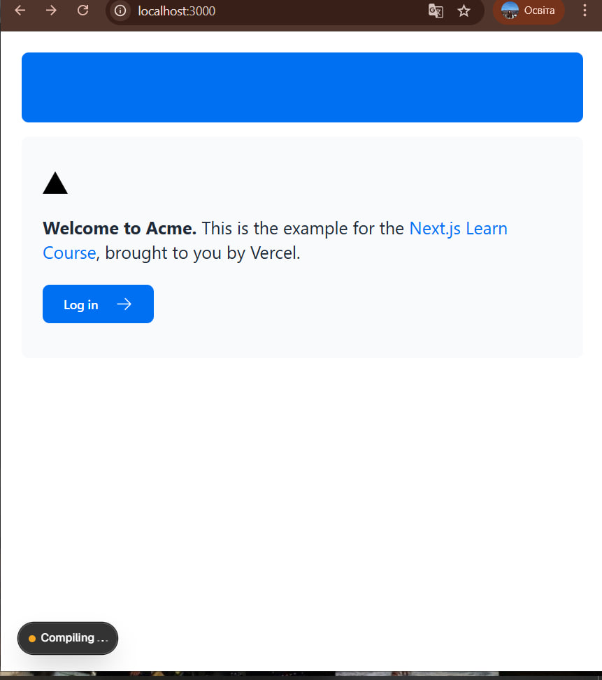


## Розділ 3. Оптимізація шрифтів та зображень

### 1. Додавання основного шрифту

У папці `/app/ui` створила новий файл:

`fonts.ts`

Імпортувала шрифт Inter з модуля `next/font/google` та вказала підмножину `latin`.

### 2. Додавання додаткового шрифту

Додала шрифт Lusitana з вагами 400 і 700 у fonts.ts.

### 3. Додавання зображень через next/image

Імпортувала компонент Image у /app/page.tsx:

```jsx
import Image from 'next/image';
```

Додала зображення для desktop та mobile

Головна сторінка відобразилась коректно.

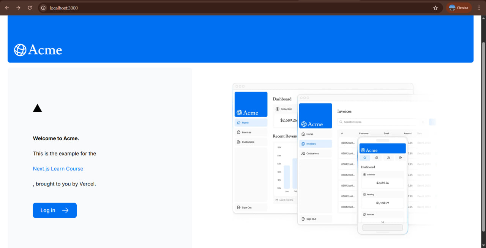

## Розділ 4. Створення макетів та сторінок

Поки що застосунок має лише головну сторінку. У цьому розділі було розглянуто, як створювати нові маршрути за допомогою сторінок та макетів.

### 1. Створення сторінки dashboard

Спочатку була створена нова папка:

```
/app/dashboard
```

У ній створено файл:

```
page.tsx
```

Після запуску dev-сервера сторінка стала доступною за адресою:

```
http://localhost:3000/dashboard
```

На сторінці відображається текст:

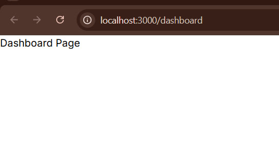

### 2. Створення сторінки Customers

Далі була створена сторінка для клієнтів.

Створено папку:

```
/app/dashboard/customers
```

У ній створено файл:

```
page.tsx
```

Сторінка доступна за адресою:

```
http://localhost:3000/dashboard/customers
```

На сторінці відображається текст:

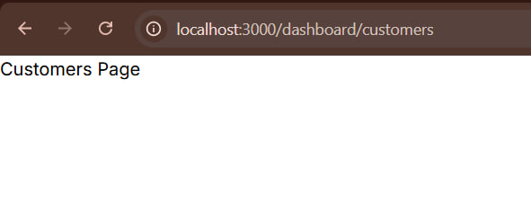

### 3. Створення сторінки Invoices

Далі створено сторінку рахунків.

Створено папку:

```
/app/dashboard/invoices
```

У ній створено файл:

```
page.tsx
```
Сторінка доступна за адресою:

```
http://localhost:3000/dashboard/invoices
```

На сторінці відображається текст:

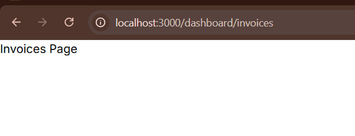

### 4. Створення макета dashboard
Було створено файл:

```
/app/dashboard/layout.tsx
```

Відображення сторінки:

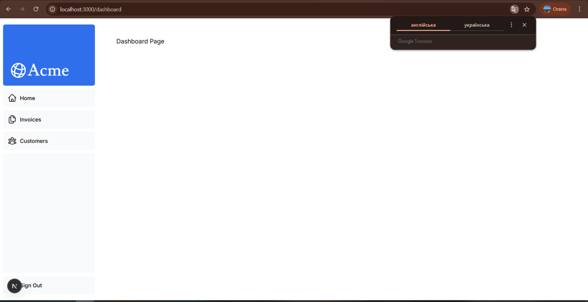


## Розділ 5. Навігація між сторінками

### 1. Використання компонента Link

Компонент `Link` дозволяє виконувати навігацію на стороні клієнта без повного перезавантаження сторінки.

Для цього потрібно імпортувати `Link` з `next/link`.

Файл:

```
/app/ui/dashboard/nav-links.tsx
```

Після заміни тегу `a` на тег `Link` переходи між сторінками відбуваються без повного оновлення сторінки, що робить застосунок швидшим та більш схожим на нативний додаток.


### 2. Попереднє завантаження сторінок

У production режимі Next.js використовує prefetching.

Коли компонент `Link` з’являється у видимій частині браузера:

- автоматично попередньо завантажує код сторінки
- робить це у фоновому режимі

Тому коли користувач натискає посилання:

- код сторінки вже завантажений
- перехід відбувається майже миттєво

Відображення сторінки:

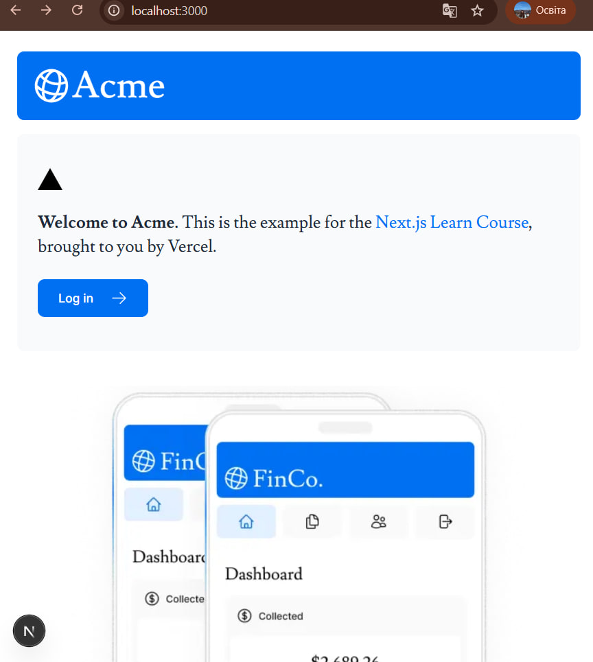


## Розділ 6. Налаштування бази даних

### 1. Завантаження проєкту на GitHub  
Репозиторій підключено до Vercel для автоматичного розгортання.  

### 2. Створення облікового запису Vercel та підключення GitHub
План: Hobby, автоматичне попереднє розгортання при push та preview URL для pull request.  

### 3. Додавання змінних середовища 
Секрети скопійовано у `.env` і додано до `.gitignore`.  

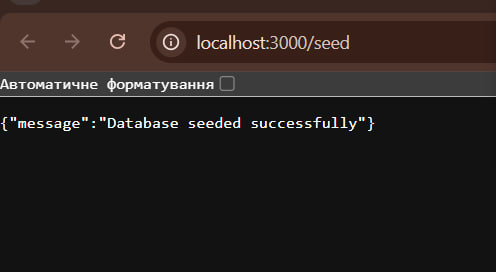

### 4. Заповнення бази даних початковими даними 
Виконано через API `http://localhost:3000/seed`.  
Повідомлення після виконання: `Database seeded successfully`.  

Відображення сторінки:


### 5. Виконання SQL-запиту для перевірки
Запит у `app/query/route.ts` повертає `amount` та `name` клієнта.  

Відображення сторінки:
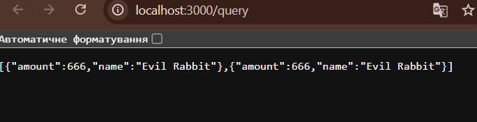

## Розділ 7. Отримання даних

У цьому розділі було розглянуто способи отримання даних у застосунку Next.js та створено сторінку огляду Dashboard.

### Отримання даних для Dashboard

Було реалізовано отримання даних для таких компонентів:

- **RevenueChart** — відображає графік доходів за останні 12 місяців.
- **LatestInvoices** — показує 5 останніх рахунків.
- **Card** — відображає статистику:
  - загальна сума оплачених рахунків
  - сума рахунків, що очікують оплати
  - кількість рахунків
  - кількість клієнтів


### Оптимізація запитів

Було розглянуто поняття **waterfall requests** (каскадні запити), коли кожен запит виконується після завершення попереднього.

Для покращення продуктивності використовується **паралельне отримання даних** за допомогою:

```javascript
Promise.all()
```

Це дозволяє запускати декілька запитів до бази даних одночасно.

### Результат

Було створено сторінку Dashboard, яка відображає:

- статистику рахунків
- графік доходів
- список останніх рахунків

Відображення сторінки:

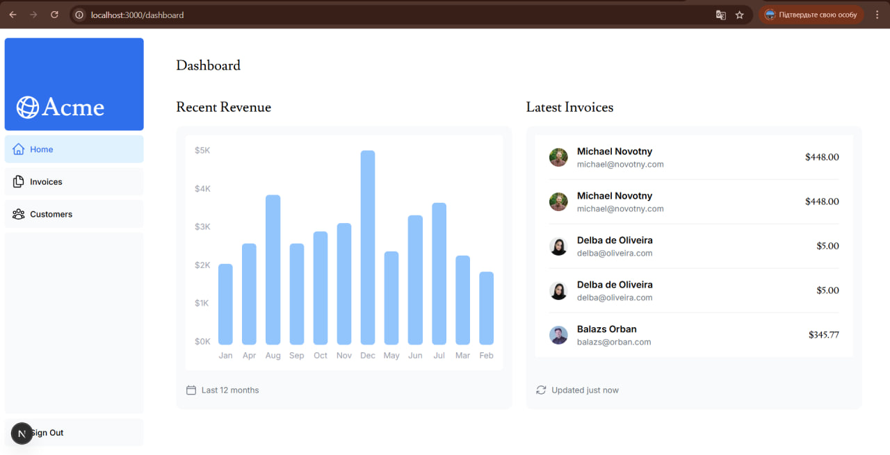

## Розділ 8. Статичний та динамічний рендеринг
У цьому розділі було розглянуто принципи **статичного та динамічного рендерингу** в Next.js та їх вплив на продуктивність застосунку.

### Моделювання повільного отримання даних

Для демонстрації повільного отримання даних у файлі:

```
/app/lib/data.ts
```

було додано штучну затримку:

```javascript
await new Promise((resolve) => setTimeout(resolve, 3000));
```

Це імітує повільний запит до бази даних.

Після запуску застосунку можна побачити у консолі:

```
Fetching revenue data...
Data fetch completed after 3 seconds.
```

Це показує, що сторінка завантажується повільніше, оскільки динамічний рендеринг залежить від швидкості отримання даних.

### Результат

Було змодельовано повільне отримання даних та продемонстровано, як це впливає на завантаження сторінки Dashboard.

Скріншот сторінки Dashboard:

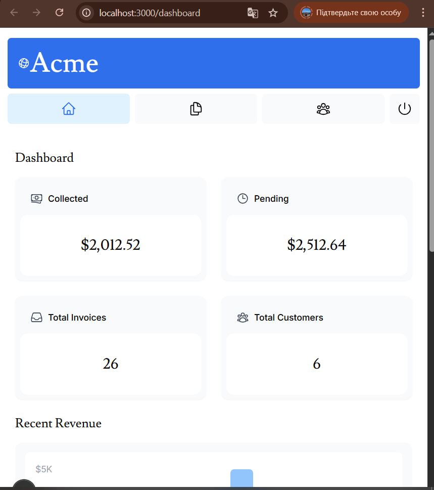

Скріншот виводу консолі:

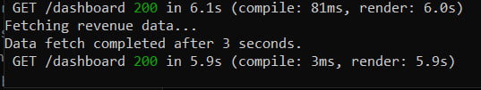

## Розділ 9. Потокове передавання

У цьому розділі було реалізовано потокове передавання даних у застосунку Next.js для покращення продуктивності та користувацького досвіду.

### Виконані кроки

- Додано файл `loading.tsx`, який показує резервний інтерфейс під час завантаження сторінки.
- Реалізовано скелет завантаження (Skeleton UI) за допомогою компонента `DashboardSkeleton`.
- Використано React Suspense для потокового передавання окремих компонентів.
- Перенесено отримання даних (`fetchRevenue`, `fetchLatestInvoices`, `fetchCardData`) безпосередньо у компоненти.
- Додано Suspense boundaries для компонентів `RevenueChart`, `LatestInvoices` та карток.
- Реалізовано компонент `CardWrapper` для групового завантаження карток.

Це дозволило показувати частини сторінки поступово, не блокуючи весь інтерфейс під час отримання даних.

### Loading сторінка
Початковий стан сторінки під час завантаження.

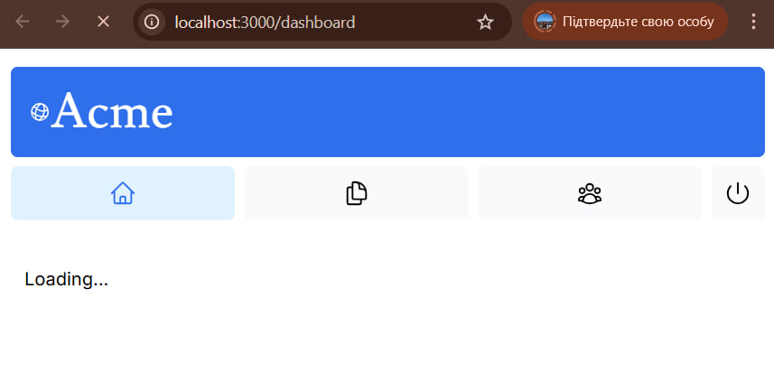

### Сторінка зі скелетом завантаження
Показується skeleton UI замість контенту.

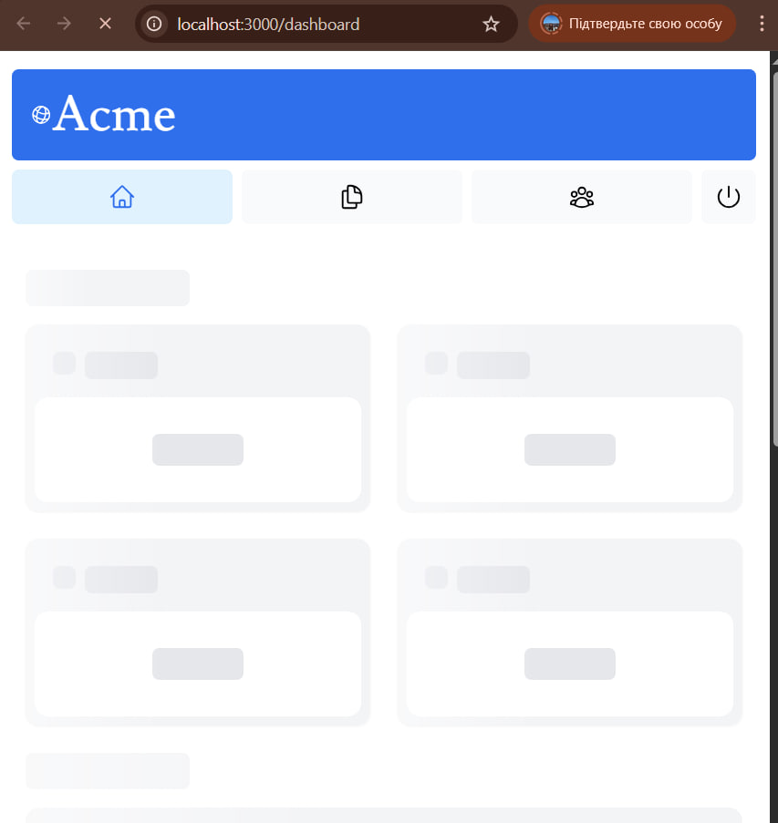

### Потокове передавання компонентів
Частина сторінки вже відображається, поки інші компоненти ще завантажуються.

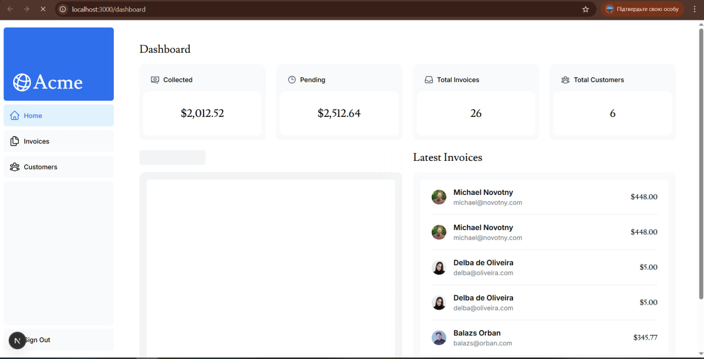

### Кінцевий вигляд сторінки
Після завантаження всіх даних відображається повний інтерфейс сторінки.

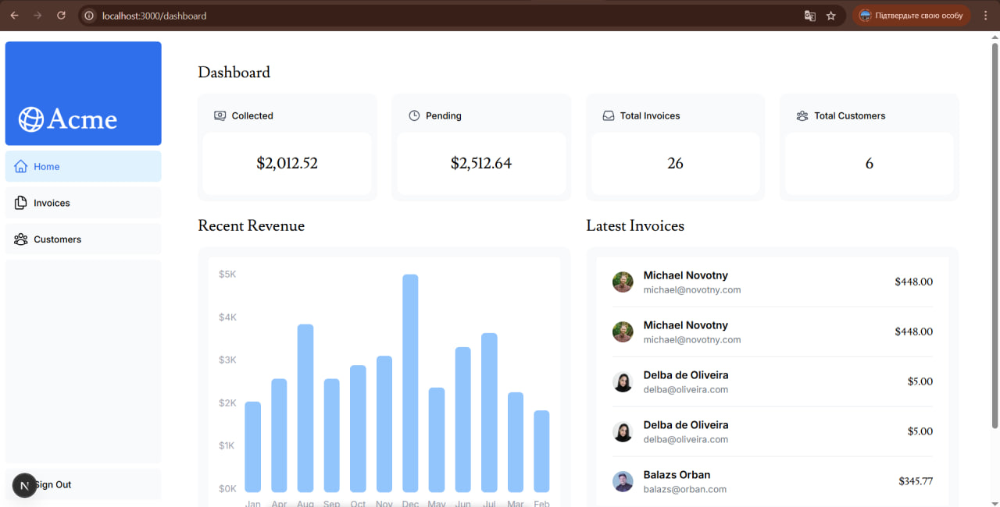

## Розділ 10. Додавання пошуку та нумерації сторінок

У цьому розділі було реалізовано пошук та пагінацію на сторінці **Invoices** у застосунку Next.js.

### Виконана робота

- Додано компонент **Search**, який дозволяє користувачам шукати рахунки-фактури.
- Реалізовано оновлення URL-параметрів за допомогою API Next.js:
  - `useSearchParams`
  - `usePathname`
  - `useRouter`
- Передано параметри пошуку до серверного компонента **Table**, щоб фільтрувати дані.
- Додано **debounce** (бібліотека `use-debounce`), щоб уникнути запиту до бази даних при кожному натисканні клавіші.
- Реалізовано **пагінацію** для перемикання між сторінками рахунків-фактур.
- Використано параметри URL (`query`, `page`).

### Пошук до застосування debounce
Кожне натискання клавіші викликає новий запит.

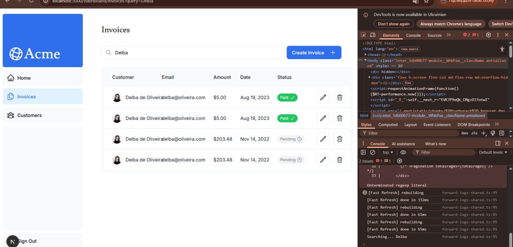

### Пошук після застосування debounce
Запит виконується лише після завершення введення користувачем.

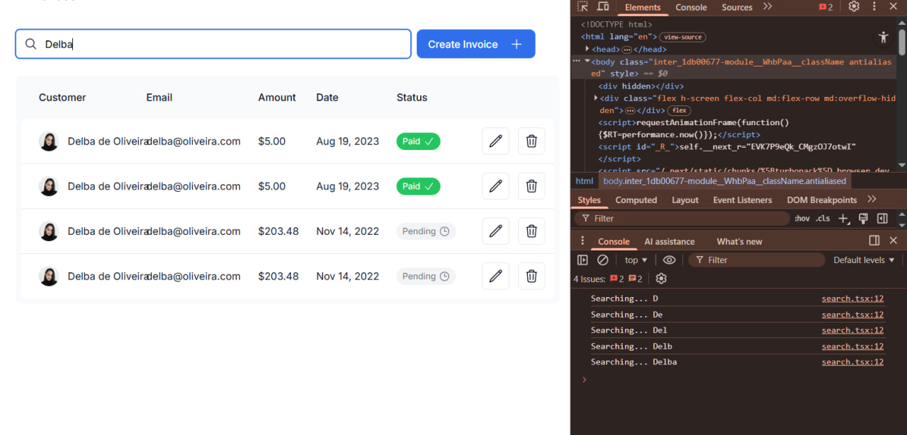

### Кінцевий вигляд сторінки
Сторінка **Invoices** з реалізованими пошуком та пагінацією.

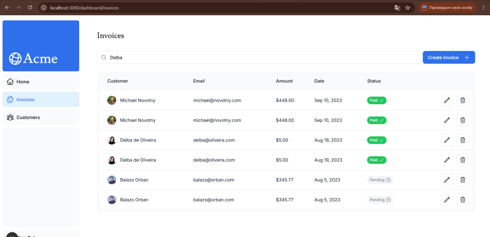

## Розділ 11. Мутація даних

#### 1. Створення рахунку-фактури

Створено новий маршрут:

```
/dashboard/invoices/create
```
- створено форму для введення:
  - клієнта
  - суми
  - статусу 
- реалізовано Server Action `createInvoice`
- отримання даних через FormData
- валідація даних за допомогою Zod
- вставка даних у PostgreSQL

#### 2. Редагування рахунку-фактури

Створено динамічний маршрут:

```
/dashboard/invoices/[id]/edit
```

#### 3. Видалення рахунку-фактури

Для видалення реалізовано:

- кнопку видалення, обгорнуту у `<form>`
- Server Action `deleteInvoice`
- SQL-запит для видалення запису з бази даних
- оновлення таблиці через:

```ts
revalidatePath('/dashboard/invoices')
```

Кінцевий результат
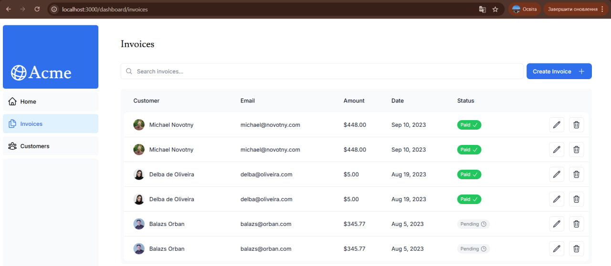

## Розділ 12. Обробка помилок

У цьому розділі було реалізовано обробку помилок.

Приклад сторінки помилки:
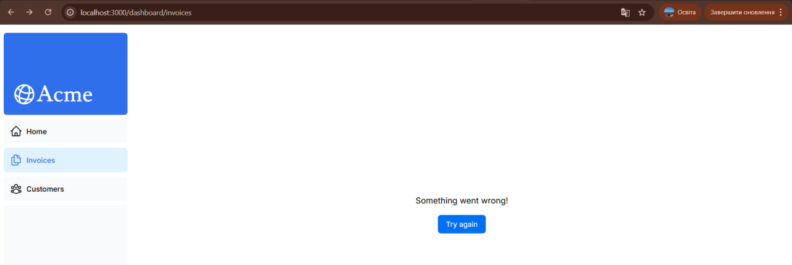

Приклад сторінки 404:
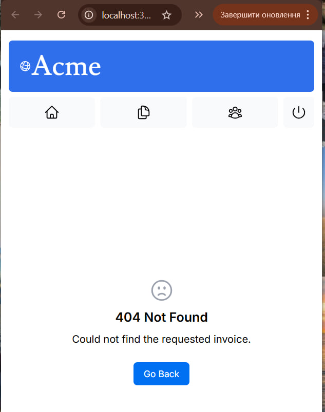

## Розділ 13. Обробка помилок

У цьому розділі було реалізовано покращення доступності форм та серверну валідацію.
- Використано семантичний HTML (`<label>`, `<input>`, `<select>`).  
- Форми перевіряються на сервері за допомогою Zod і Server Actions.  
- Відображаються помилки користувачеві через `useActionState`.

## Розділ 14. Додавання автентифікації

У цьому розділі реалізовано автентифікацію користувачів за допомогою NextAuth.js, додано форму входу та захист маршрутів панелі інструментів. Користувач може увійти за електронною поштою та паролем, а також вийти з системи.

Приклад сторінки входу:  
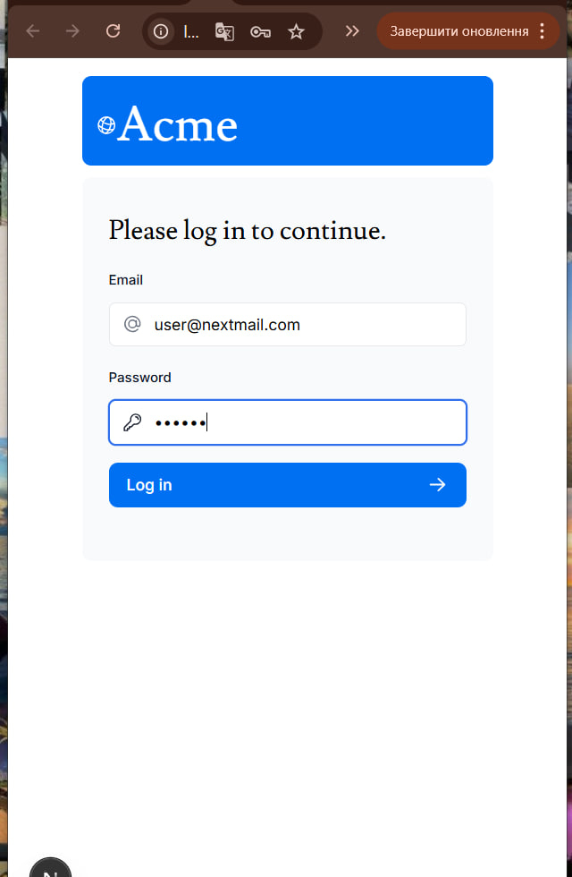

## Розділ 15. Додавання метаданих

У цьому розділі ми додали метадані до сторінок програми для покращення SEO та зручності поширення в соціальних мережах.

Приклади сторінок з доданими метаданими:

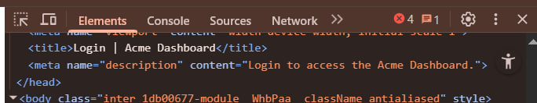
 
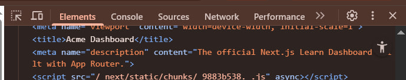

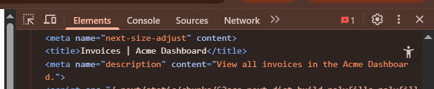

